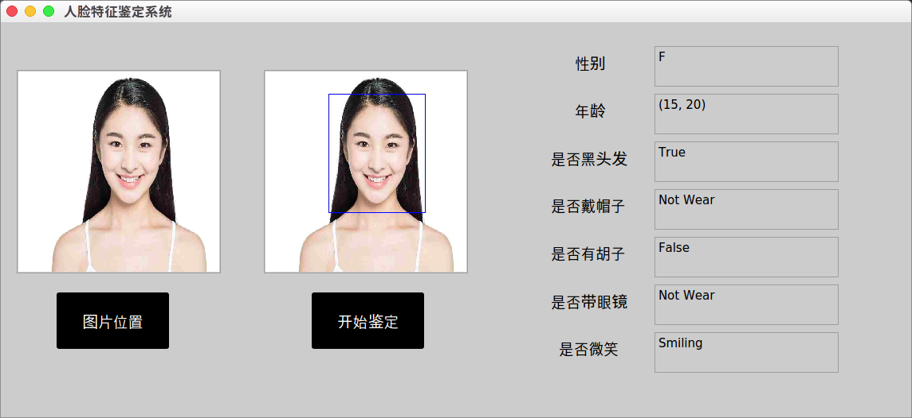

FacialAttribution Analysis:  Deep Learning with TensorFlow
============================================================

## Goal
Identity facial attribution by convolution neural network.

## Core Module
Fine tune Inception V3 module

modify last layer, add dropout, do avg_pool2d, flatten, and a fully connected layer, finally softmax.

## Platform
Temporaly Ubuntu 16.04 Tensorflow 1.2 cuda8.0 cudNN v6 Nvidia gtx860m

10.01 Update, NUAA CS_lab_105, 

GPU: GTX1080ti 11g memory 

CPU: Core i7 7700k, 32g memory 

provided by **Prof.Zhang**

## Preprocess
1. Find image filenames and image labels then save them into two lists 
2. Process image files then save them into TFRecord files
   * Using 8(uncertain, can be passed by tf.app.flags) threads
   * Using mini-batch
3. Resample all images into jpeg type

## Training
1. Based on [Inception-V3](https://arxiv.org/abs/1512.00567), using a module (tensorflow.contrib.slim), which provide the interface

2. ​

   * default optimizer: Momentum

   * default batch size: 32

3. Pretrained model: [im2txt](https://github.com/tensorflow/models/tree/master/research/im2txt#download-the-inception-v3-checkpoint)'s Inception v3 model.

4. Using the preprocess's output----TFrecords file as training data

## Deploy

1. guess.py provide a interface to read a image, draw a bounding box, and generate a series of labels, including **age**, **gender**, **smiling**, **hat**, **eyeglass**, **black hair** and **mustache**.
2. bounding box function is provided by opencv   ~~(because I don't know how to do object detection by convolutional neural network 23333333)~~ 

## GUI

1. Using pyqt5 module

2. Two file widget.py and test.py.  Run widget.py, click 图片位置， choose a image and click 开始鉴定. And the result will be look like this: 

   

## Acknowledge

1. **Prof.Zhang**, Our adviser. 
2. Multimedia Lab, The Chinese University of Hong Kong, which provided the [dataset](http://personal.ie.cuhk.edu.hk/~lz013/projects/CelebA.html).

